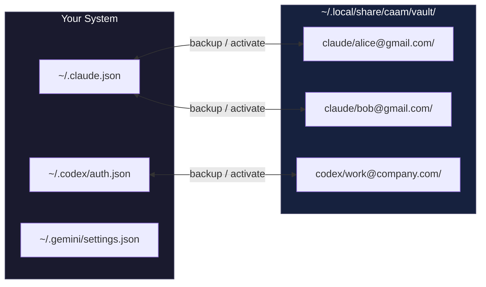

# caam - Coding Agent Account Manager


> **Sub-100ms account switching for AI coding CLIs. When you hit usage limits, don't wait 60 seconds for browser OAuth—just swap auth files instantly.**

```bash
# Install
curl -fsSL "https://raw.githubusercontent.com/Dicklesworthstone/coding_agent_account_manager/main/install.sh?$(date +%s)" | bash

# Use
caam backup claude alice@gmail.com      # Save current auth
caam activate claude bob@gmail.com      # Switch instantly
```

---

## The Problem

You're deep in flow, Claude Max shows a rate limit. The official way to switch accounts:

```
/login → browser opens → sign out of Google → sign into different Google →
authorize app → wait for redirect → back to terminal
```

**That's 30-60 seconds of friction.** Multiply by 5+ switches per day across multiple tools.

## The Solution

Each AI CLI stores OAuth tokens in plain files. `caam` backs them up and restores them:

```bash
caam activate claude bob@gmail.com   # ~50ms, done
```

No browser. No OAuth dance. No interruption to your flow state.

---

## How It Works



**That's it.** No daemons, no databases, no network calls. Just `cp` with extra steps.

### Why This Works

OAuth tokens are bearer tokens—possession equals access. The CLI tools don't fingerprint your machine beyond what's already in the token file. Swapping files is equivalent to "being" that authenticated session.

### Profile Detection

`caam status` uses **content hashing** to detect the active profile:

1. SHA-256 hash current auth files
2. Compare against all vault profiles
3. Match = that's what's active

No state files that can desync. Works after reboots. Detects manual switches.

---

## Supported Tools

| Tool | Auth Location | Login Command |
|------|--------------|---------------|
| **Claude Code** | `~/.claude.json` + `~/.config/claude-code/auth.json` | `/login` in CLI |
| **Codex CLI** | `~/.codex/auth.json` | `codex login` |
| **Gemini CLI** | `~/.gemini/settings.json` | Interactive prompt |

---

## Quick Start

### 1. Backup Your Current Account

```bash
# After logging into Claude normally
caam backup claude alice@gmail.com
```

### 2. Add Another Account

```bash
caam clear claude                        # Remove current auth
claude                                   # Login as bob@gmail.com via /login
caam backup claude bob@gmail.com         # Save it
```

### 3. Switch Instantly

```bash
caam activate claude alice@gmail.com     # Back to Alice
caam activate claude bob@gmail.com       # Back to Bob
```

### 4. Check Status

```bash
$ caam status
claude: alice@gmail.com (active)
codex:  work@company.com (active)
gemini: (no auth files)

$ caam ls claude
alice@gmail.com
bob@gmail.com
carol@gmail.com
```

---

## Commands

| Command | Description |
|---------|-------------|
| `caam backup <tool> <email>` | Save current auth to vault |
| `caam activate <tool> <email>` | Restore auth from vault |
| `caam status [tool]` | Show active profiles |
| `caam ls [tool]` | List saved profiles |
| `caam delete <tool> <email>` | Remove saved profile |
| `caam clear <tool>` | Delete auth files (logout) |
| `caam paths [tool]` | Show auth file locations |

**Aliases:** `switch`, `use` → `activate`

---

## Advanced: Parallel Sessions

For running multiple accounts **simultaneously** (different terminal windows):

```bash
# Create isolated environments
caam profile add codex work@company.com
caam profile add codex personal@gmail.com

# Login to each (one-time browser flow)
caam login codex work@company.com
caam login codex personal@gmail.com

# Run with isolation
caam exec codex work@company.com -- "implement feature"
caam exec codex personal@gmail.com -- "review PR"
```

Each profile gets its own `$HOME` and `$CODEX_HOME` with symlinks to your real `.ssh`, `.gitconfig`, etc.

---

## Vault Structure

```
~/.local/share/caam/vault/
├── claude/
│   ├── alice@gmail.com/
│   │   ├── .claude.json
│   │   ├── auth.json
│   │   └── meta.json        # backup timestamp
│   └── bob@gmail.com/
│       └── ...
├── codex/
│   └── work@company.com/
│       └── auth.json
└── gemini/
    └── personal@gmail.com/
        └── settings.json
```

---

## FAQ

**Is this against ToS?**

No. You're using your own paid subscriptions. `caam` doesn't share accounts, bypass rate limits, or touch network traffic. Each account still has its own usage limits.

**Will switching break a running session?**

The running CLI may throw auth errors. Best practice: switch between sessions, not during.

**Can I sync vault across machines?**

Don't. Auth tokens often contain machine identifiers. Backup separately on each machine.

**What if auth file locations change?**

Run `caam paths` to see current locations. File an issue if they've changed.

---

## Installation

**One-liner:**
```bash
curl -fsSL "https://raw.githubusercontent.com/Dicklesworthstone/coding_agent_account_manager/main/install.sh?$(date +%s)" | bash
```

**From source:**
```bash
git clone https://github.com/Dicklesworthstone/coding_agent_account_manager
cd coding_agent_account_manager && go build -o caam ./cmd/caam
sudo mv caam /usr/local/bin/
```

**Go install:**
```bash
go install github.com/Dicklesworthstone/coding_agent_account_manager/cmd/caam@latest
```

---

## License

MIT
